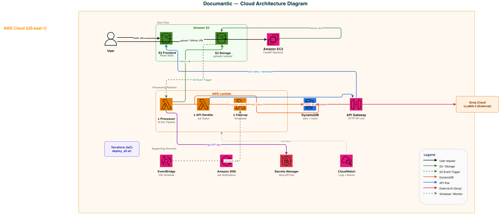

# Documantic — AI-Powered Code Documentation Generator

Documantic is a web-based developer tool that automatically generates comprehensive documentation for any codebase. Upload a zip file or paste a public GitHub URL, and Documantic's AI pipeline produces a complete documentation package in under 2 minutes.

---

## What it generates

| Output | Description |
|--------|-------------|
| `README.md` | Project overview, tech stack, setup instructions, API endpoints, and usage examples |
| `API_DOCS.md` | Every function and class documented with parameters, return types, and descriptions |
| `QUALITY_REPORT.md` | Code quality scorecard with complexity analysis, issues, quick wins, and a letter grade out of 100 |
| Inline commented source | Original code files returned with explanatory comments on the "why" behind the logic |

---

## Architecture



### Tech Stack

| Layer | Technology |
|-------|-----------|
| Frontend | React + TypeScript |
| Backend API | FastAPI (Python) on AWS EC2 |
| AI Pipeline | LLaMA-3 via Groq API |
| Processing | AWS Lambda (async job queue) |
| Storage | AWS S3 (code input + generated docs) |
| Database | AWS DynamoDB (users, job metadata) |
| Auth | JWT-based authentication |
| Email | AWS SES |
| Infrastructure | Terraform |

### Request Flow

1. User submits a zip file or GitHub URL via the React frontend
2. FastAPI backend validates the input, stores it in S3, and enqueues a job in DynamoDB
3. A Lambda processor picks up the job, calls the Groq API (LLaMA-3), and generates documentation
4. Completed docs are stored in S3 and the job status is updated
5. Frontend polls for completion and presents download links

---

## Project Structure

```
documantic/
├── frontend/          # React + TypeScript app
├── backend/           # FastAPI server (EC2)
├── lambda/
│   ├── api/           # Job submission Lambda
│   ├── processor/     # AI documentation generator
│   └── cleanup/       # S3 cleanup on job expiry
├── terraform/         # Full AWS infrastructure as code
└── deploy_all.sh      # One-command deployment script
```

---

## Getting Started

### Prerequisites

- Node.js 18+
- Python 3.11+
- Terraform 1.5+
- AWS CLI configured
- Groq API key

### Infrastructure

```bash
cd terraform
cp terraform.tfvars.example terraform.tfvars
# Fill in your values in terraform.tfvars
terraform init
terraform apply
```

### Backend

```bash
cd backend
pip install -r requirements.txt
uvicorn main:app --reload
```

### Frontend

```bash
cd frontend
npm install
npm start
```

---

## Environment Variables

See `terraform/terraform.tfvars.example` for all required values. Secrets are managed via AWS Secrets Manager at runtime — no secrets are stored in code.

---

## Course

CSCI5409 — Advanced Topics in Cloud Computing, Winter 2026, Dalhousie University
